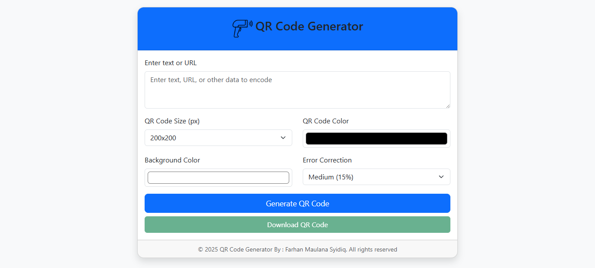

# QR Code Generator Website



A responsive web application for generating customizable QR codes using HTML, CSS, and JavaScript with Bootstrap 5.

## Features

- 🚀 Generate QR codes from text, URLs, or other data
- 🎨 Customize QR code appearance:
  - Adjustable size (100px to 300px)
  - Custom foreground and background colors
  - Selectable error correction levels
- 💾 Download QR codes as PNG images
- 📱 Fully responsive design
- ⚡ Client-side only - no server required

## Technologies Used

- **Frontend**: 
  - Bootstrap 5 (CSS framework)
  - QRCode.js (QR code generation library)
- **Hosting**: Can be deployed on any static hosting service

## Installation

No installation required! This is a client-side only application. Simply open `index.html` in any modern web browser.

For development:

1. Clone the repository:
   ```bash
   git clone https://github.com/aleaengineer/qrcodegenerator.git
   ```
2. Open the project folder:
   ```bash
   cd qrcodegenerator
   ```
3. Open `index.html` in your browser

## Usage

1. Enter your text or URL in the input field
2. Customize the QR code settings:
   - Size
   - Colors (foreground and background)
   - Error correction level
3. Click "Generate QR Code"
4. Download the QR code by clicking "Download QR Code"

## SEO Optimization

The website includes comprehensive meta tags for:
- Search engine optimization
- Social media sharing (Open Graph and Twitter Cards)
- Mobile browser compatibility
- Favicons for all devices

## Browser Support

The application works on all modern browsers including:
- Chrome
- Firefox
- Safari
- Edge
- Mobile browsers

## License

This project is open source and available under the [MIT License](LICENSE).

## Contributing

Contributions are welcome! Please open an issue or submit a pull request for any improvements.

## Acknowledgements

- [QRCode.js](https://github.com/davidshimjs/qrcodejs) - QR code generation library
- [Bootstrap 5](https://getbootstrap.com/) - CSS framework

---

**Note**: Remember to replace placeholder URLs, images, and personal information with your actual project details before publishing.